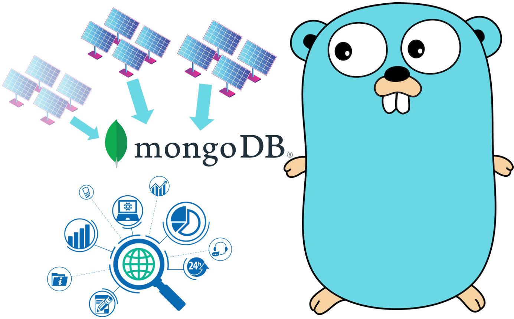

<a name="readme-top"></a>


<!-- PROJECT SHIELDS -->
<!--
*** https://www.markdownguide.org/basic-syntax/#reference-style-links
-->
<!-- [![Golang][golang-shield]][golang-url] -->
[](https://goreportcard.com/report/github.com/paulmuenzner/powerplantmanager)
[](https://app.codacy.com/gh/paulmuenzner/powerplantmanager/dashboard?utm_source=gh&utm_medium=referral&utm_content=&utm_campaign=Badge_grade)
[![Issues][issues-shield]][issues-url]

[![GNU License][license-shield]][license-url]


 <!-- [![paulmuenzner.com][website-shield]][website-url] -->
[![paulmuenzner github][github-shield]][github-url] 
[![Contributors][contributors-shield]][contributors-url]


<!-- PROJECT LOGO -->
<br />
<div align="center">
  <a href="https://github.com/paulmuenzner/powerplantmanager">
    
  </a>

  <h3 align="center">Golang Photovoltaic Plant Management Server</h3>

  <p align="center">
    Administration - Logging - Statistical Analysis
    <br />
    <a href="#about-the-project"><strong>EXPLORE DOCS</strong></a>
    <br />
    <br />
    <a href="#configuration">High Flexibility</a>
    ·
    <a href="https://github.com/paulmuenzner/powerplantmanager/issues">Report Bug</a>
    ·
    <a href="https://github.com/paulmuenzner/powerplantmanager/issues">Request Feature</a>
  </p>
</div>


<!-- TABLE OF CONTENTS -->
<details>
  <summary>Table of Contents</summary>
  <ol>
    <li><a href="#about-the-project">About The Project</a></li>
    <li><a href="#getting-started">Getting Started</a></li>
    <li><a href="#usage">Usage</a></li>
    <li><a href="#roadmap">Roadmap</a></li>
    <li><a href="#contributing">Contributing</a></li>
    <li><a href="#license">License</a></li>
    <li><a href="#contact">Contact</a></li>
    <li><a href="#acknowledgments">Acknowledgments</a></li>
  </ol>
</details>


<!-- ABOUT THE PROJECT -->
## About The Project

Introducing the Photovoltaic Plant Management System, a comprehensive software solution designed for seamless management of photovoltaic power plants. Users can register, verify accounts, and leverage a secure authentication system for streamlined access. Plant registration is made easy, allowing users to input technical details and upload related images and files for each power plant.

The system provides a dedicated Logging API for each registered power plant. This API facilitates the logging of various information sent by the power plants at configurable time intervals – a flexible solution for data tracking, whether it be at 15-minute intervals, 1-minute intervals, or a custom setting.

Security is a top priority, and the system implements robust measures to protect APIs. Users can secure their Logging APIs using keys, secrets, and IP filters. IP whitelisting adds an extra layer of security, ensuring that only authorized IP addresses have access.

In addition to efficient data logging, the Photovoltaic Plant Management System incorporates a statistical evaluation and data assessment feature. This functionality allows users, whether individual enthusiasts or businesses managing multiple photovoltaic installations, to analyze and interpret the logged data comprehensively. The system's data assessment tools provide valuable insights, making the management of solar assets straightforward and effective.


### Features
-   Create and use accounts using registration, verification, signin, signout functionality
-   Register your photovoltaic power plants and related technical information into the system and upload related plant images and files
-   Create individual logging API for each registered power plant to log several information sent from our power plant in configured time intervals (eg. each 15 minuts, each 1 minute, ...) 
-   Protect your APIs with key, secret and IP whitelisting
-   Validation middleware for individual assessments implemented for each route 
-   Validation handler for chained input validation individually customizable according to your own needs
-   Flexible error handler covering 32 HTTP 4** status codes
-   Flexible response handler for positive 2** responses covering 10 HTTP status codes
-   Central collection, overview and management of configuration values in config folder
-   Central Regex Expression library with several predefined and tested expressions
-   Setup of MongoDB connection including prepared templates to query, save and delete
-   Logging with logrus to daily log files in log folder: Logging error, time, log level.
-   Deletion of log files in log folder older than 5 days (default). Can be changed in base_config file with 'DeleteLogsAfterDays'
-   AWS functions to upload and delete files and images for your power plant to S3 change their names
-   Strict file upload validations: number, sizes, type
-   Fully-featured cookie handler
-   This Golang server boasts a robust architecture designed for flexibility, reduced coupling and testibiliy through a dedicated Dependency Injection (DI) setup. The core functionalities of database communications, and AWS operations and sending email notifications are seamlessly integrated, providing a cohesive and modular solution.
-   Context extensions enabling to reuse queried data amongst more than one controller within one route an thus reducing number of database requests
-   JWT setup needed for authentication and authorization
-   Documentation an description of function an controllers
-   Practical examples for testing with [Go Testify](https://github.com/stretchr/testify)
-   Transactions implemented. Transactions in MongoDB ensure the atomicity, consistency, isolation, and durability (ACID) properties for multiple database operations, allowing developers to group multiple statements into a single unit of work that either succeeds entirely or fails without leaving the database in an inconsistent state.
-   Encryption, Decryption, token and hashing functions 
-   Implemented dependency injection to manage dependencies and improve testability.
-   Email setup for sending transactional emails with your provider


### Security

-   Key, Secret & URL ID Protection: Secure Logging APIs using unique keys, secrets and an individual URL id.
-   IP Filtering: Implement IP whitelisting to allow logging access only to authorized IP addresses.
-   Validation Middleware: Validation middleware for individual assessments implemented on each route.
-   Validation Handler: Implement a validation handler for chained input validation, expandable and customizable to specific needs.
-   Error Handling: Flexible error handler covering 32 HTTP 4xx status codes for robust error management.
-   Response Handling: Flexible response handler for positive 2xx responses, covering 10 HTTP status codes.
-   Cookie Security: Fully-featured cookie handler for enhanced security.
-   JWT Authentication: Set up JWT for authentication and authorization.
-   Verification token: Encrypted verification token for verifying email addresses and registrations.
-   Encryption and Hashing: Implement encryption, decryption, and hashing functions for data security.
-   Robust Error Handling Mechanism: Any encountered errors are diligently logged to the designated log folder and simultaneously partly dispatched via email notifications.
-   Method Validation: Custom middleware to check request methods with the allowed methods parameter.
-   Provides partial defense against Slowloris attacks.
-   Rate limiter implemented.

<p align="right">(<a href="#readme-top">back to top</a>)</p>

### Tech Stack <a name="tech-stack"></a>

This project is basically built with and for:

*   [![Aws][aws-shield]][aws-url]
*   [![Golang][golang-shield]][golang-url]
*   [![MongoDB][mongodb-shield]][mongodb-url]

<p align="right">(<a href="#readme-top">back to top</a>)</p>


<!-- GETTING STARTED -->
## Getting Started

Prior to launching the program, clone the repo, install go dependencies and ensure that all configurations are set. 


### Prerequisites 
-   Make sure MongoDB is installed and available.
-   Make sure a properly configured [AWS S3 Bucket](https://aws.amazon.com/s3/?nc1=h_ls) is ready.


### Installation

-   Clone the repo
   ```sh
   git clone https://github.com/paulmuenzner/powerplantmanager.git
   ```
-   Install go dependencies by running
   ```sh
   go get
   ```

### Environment file (.env)
Before running the program, you need to set up the required environment variables by creating a .env file in the root directory of the project. This file holds sensitive information and configurations needed for the proper functioning of the application.

#### Mandatory Environment Variables

AWS S3 & MongoDB Configuration:

If your application involves interactions with AWS S3, you must provide the following key-value pairs in the .env file:

-   AWS_S3_BUCKET_NAME: The name of your AWS S3 bucket.
-   AWS_REGION: The AWS region where your S3 bucket is located.
-   AWS_ACCESS_KEY_ID: Your AWS access key ID.
-   AWS_SECRET_ACCESS_KEY: Your AWS secret access key.
-   MONGODB_SCHEME: MongoDB Scheme (likely mongodb) 
-   MONGODB_HOST: MongoDB Host (localhost if self-hosted running locally. Read more on [mongodb.com](https://www.mongodb.com/docs/manual/reference/connection-string/).) 
-   MONGODB_PORT: MongoDB Port, eg. 27018 or standard port 27017. Read more on [mongodb.com](https://www.mongodb.com/docs/manual/reference/connection-string/).
-   MONGODB_DATABASE_NAME: Name of your MongoDB database you like to backup.


#### Optional Environment Variables

Email Notification Configuration:

If you intend to use email notifications (configured with SendEmailNotifications in the config file), include the following additional variables in your .env file:

-   EMAIL_PROVIDER_PASSWORD: Password for the email provider.
-   EMAIL_PROVIDER_USERNAME: Username for the email provider.
-   EMAIL_PROVIDER_SMTP_PORT: SMTP port for the email provider.
-   EMAIL_PROVIDER_HOST: Hostname of the email provider.
-   EMAIL_ADDRESS_SENDER_BACKUP: Sender email address for backup notifications.
-   EMAIL_ADDRESS_RECEIVER_BACKUP: Receiver email address for backup notifications.
-   MONGODB_USERNAME: Username as part of your MongoDB connection string if needed. Read more on [mongodb.com](https://www.mongodb.com/docs/manual/reference/connection-string/).
-   MONGODB_PASSWORD: Password as part of your MongoDB connection string if needed. Read more on [mongodb.com](https://www.mongodb.com/docs/manual/reference/connection-string/).

#### Important Note

Make sure to keep your '.env' file secure and do not share it publicly.

The program relies on these configurations to run successfully. Without the correct values in the .env file, certain features may not work as expected.

#### Template

Here's an example .env template in code format. Replace "your-..." placeholders with your actual values. Ensure that this file is kept secure, and sensitive information is not shared publicly. Users should fill in the appropriate values for their specific configurations.
```sh
# Port
PORT=your-port

# Token and Secrets
KEY_VERIFY_TOKEN=your-key-verify-token
JWT_SECRET_KEY=your-jwt-secret-key

# AWS S3 Configuration
AWS_ACCESS_KEY_ID=your-access-key-id
AWS_SECRET_ACCESS_KEY=your-secret-access-key
AWS_REGION=your-aws-region
AWS_S3_BUCKET_NAME=your-s3-bucket-name

# Database Configuration 
MONGODB_SCHEME=mongodb
MONGODB_USERNAME=your-mongodb-username # Optional
MONGODB_PASSWORD=your-mongodb-password # Optional
MONGODB_HOST=localhost
MONGODB_PORT=your-mongodb-port # Likely 27017

# Email Notification Configuration (Optional)
EMAIL_PROVIDER_PASSWORD=your-email-provider-password
EMAIL_PROVIDER_USERNAME=your-email-provider-username
EMAIL_PROVIDER_SMTP_PORT=your-smtp-port
EMAIL_PROVIDER_HOST=your-email-provider-host
EMAIL_ADDRESS_SENDER_BACKUP=your-sender-email-address
EMAIL_ADDRESS_RECEIVER_BACKUP=your-receiver-email-address
```
<p align="right">(<a href="#readme-top">back to top</a>)</p>

### Configuration
<a name="configuration"></a>
The following configurations can be modified in the config file located at => /config/...
All values are pre-configured with default settings, ensuring the server is ready to run and the program is ready for use.

| Key                               |  Description |  Type |  Example 
|:-----                             |:---------    |:---------  |:---------  
| URL                               | The URL for accessing the server hosting this program. | string|   https://www.example.com 
| WriteTimeout                      | This parameter determines the maximum duration allowed for the server to write a response to a client. This ensures timely completion of write operations. The timeout is set to config.WriteTimeout seconds, providing flexibility in adjusting the duration based on specific requirements. | int|   5  
| ReadTimeout                      | This parameter parameter sets the maximum duration permitted for the server to read an entire request from a client. It helps manage the time allocated for processing incoming requests. The timeout is configured to config.ReadTimeout seconds, allowing customization based on the desired duration. | int|   20 
| IdleTimeout                      | This parameter dictates the maximum duration the server can keep an idle (keep-alive) connection open. This is crucial for optimizing resource usage and maintaining efficient connections. The timeout is adjusted to config.IdleTimeout seconds, providing control over the duration of idle connections. | int|   60
| DeleteLogsAfterDays                | Errors are logged to the 'log/' folder, with log file names assigned based on the day. All logs generated within a day are consolidated into a designated backup file. This parameter determines the number of days after which log files will be automatically deleted. | int|   5 
| PlantNameLength                | Maximum permitted length of a plant name each user can register. | int|   50 
| IntervalSecDefault                | Default interval, in seconds, for enabling data logging to the plant logger. | int|   15 * 60
| DatabaseNameUserAuth                | Name of the database used to store user authentication information. | string|   PlantDB
| DatabaseNameFiles                | Name of the database used to store uploaded file information. | string|   PlantDB
| DatabaseNamePlants                | Name of the database used to store photovoltaic plant information. | string|   PlantDB
| DatabaseNamePlantLoggerConfig     | Name of the database used to store individual logger settings for each plant separately. | string|   PlantDB
| DatabaseNamePlantLogger            | Name of the database used to store collections for each plant logger. Each plant has separate collection in this database. | string|   PlantDBLogger
| UserAuthCollectionName            | Name of the collection used to store user auth information. | string|   user_auth
| CollectionNameFiles            | Name of the collection used to store file information. | string|   files
| CollectionNamePhotovoltaicPlant            | Name of the collection used to store plant information. | string|   pv_plants
| CollectionNamePlantLoggerConfig            | The first part of the name of the plant collection is used to store logs, while the second part is a randomly generated ID (Eg. plant_logger_config_365889547). | string|   plant_logger_config
| MinLengthPassword            | Minimum permitted length of provided user passwords for account registration. | int|  12
| MaxLengthPassword            | Maximum permitted length of provided user passwords for account registration. | int|  50
| MaxLengthEmailAddress            | Maximum permitted length of provided user email address for account registration. | int|   60
| AuthCookieLifetimeSeconds            | Lifetime of authentication cookies. | int|   1 * 60 * 60
| AuthCookieJWTLifetimeSeconds            | Lifetime of JWT token for authentication cookies. | int|   1 * 60 * 60
| AuthCookieName            | Name of authentication cookies. | string|   authCookie
| TimeValidVerifyTokenMinutes            | Validity of verification token used for finalization registration process. | int|   15
| EmailSendNotifications            |Decide whether you want to send email notifications or not. Emails are sent in both cases error and successfully completed backup. |bool| false
| EmailProviderUserNameEnv          |Name of .env key. The value behind this .env key is placed in your .env file. Needed, if you want to send transactional email notifications. Ask your provider for this value.|string| "EMAIL_PROVIDER_USERNAME"
| EmailProviderPasswordEnv          |Name of .env key. The value behind this .env key is placed in your .env file. Needed, if you want to send transactional email notifications. Ask your provider for this value.|string| "EMAIL_PROVIDER_PASSWORD"
| EmailProviderSMTPPortEnv                       | Name of .env key. The value behind this .env key is placed in your .env file. Needed, if you want to send transactional email notifications. Ask your provider for this value.          |string| "EMAIL_PROVIDER_SMTP_PORT"
| EmailProviderHostEnv              |Name of .env key. The value behind this .env key is placed in your .env file. Needed, if you want to send transactional email notifications. Ask your provider for this value.| string|"EMAIL_PROVIDER_HOST"
| EmailAddressSenderEnv             |Name of .env key. The value behind this .env key is placed in your .env file. Needed, if you want to send transactional email notifications. Ask your provider for this value.| string|"EMAIL_ADDRESS_SENDER_BACKUP"
| EmailAddressReceiverEnv           |Name of .env key. The value behind this .env key is placed in your .env file. Needed, if you want to send transactional email notifications. Ask your provider for this value.| string|"EMAIL_ADDRESS_RECEIVER_BACKUP"
| S3BucketEnv                   |Name of .env key to configure bucket name. The value behind this .env key is placed in your .env file. Needed, to configure AWS S3. Check your S3 AWS dashboard for this value. The bucket with the exact same name must be ready in your AWS account.|string| "AWS_S3_BUCKET_NAME"
| S3RegionEnv                   |Name of .env key to configure S3 region. The value behind this .env key is placed in your .env file. The region with the exact same name is mentioned in your AWS account.| string|"AWS_REGION"
| S3AccessKeyEnv                |Name of .env key to add S3 access key. The value behind this .env key is placed in your .env file. The access key is available in your AWS account.| string|"AWS_ACCESS_KEY_ID"
| S3SecretKeyEnv                |Name of .env key to add S3 secret key. The value behind this .env key is placed in your .env file. The secret key is available in your AWS account.| string|"AWS_SECRET_ACCESS_KEY"  
| MongoDatabaseSchemeEnv        |Name of .env key to define a MongoDB scheme. The value behind this .env key is placed in your .env file. |string| "MONGODB_SCHEME"
| MongoDatabaseUsernameEnv      |Name of .env key to define a MongoDB user name if needed. The value behind this .env key is placed in your .env file. |string| "MONGODB_USERNAME"
| MongoDatabasePasswordEnv      |Name of .env key to define a MongoDB password if needed. The value behind this .env key is placed in your .env file. |string| "MONGODB_PASSWORD"
| MongoDatabaseHostdEnv         |Name of .env key to define a MongoDB host. The value behind this .env key is placed in your .env file. |string| "MONGODB_HOST"
| MongoDatabasePortEnv          |Name of .env key to define a MongoDB port number. The value behind this .env key is placed in your .env file. |string| "MONGODB_PORT"


### Run program

Run program by: `go run main.go` or use live-reloader such as [air](https://github.com/cosmtrek/air) with `air`


<p align="right">(<a href="#readme-top">back to top</a>)</p>


<!-- USAGE -->
## Usage

This server exposes various endpoints to facilitate authentication, file management, and plant-related operations.


### Routes 

#### Authentication 

The authentication API '/auth' offers secure endpoints for user authentication. Response format is always JSON besides file upload which is form-data.

1. **`/auth/registration`**
   - **Method:** POST
   - **Description:** Register a new user with the system.
   - **Authentication Required:** No
   - **Request Body Example:**
     ```json
     {
       "email": "myname@emailexample.com"
     }
     ```

2. **`/auth/verify`**
   - **Method:** POST
   - **Description:** Verify registered account with link using verify token sent to the registered email address.
   - **Authentication Required:** No
   - **Request Body Example:**
     ```json
     {
       "password": "StrongPassword",
       "passwordVerify": "StrongPassword",
       "verifyToken": "y6X2NpA8bPAAdLZRxUT7aqNL-e9eqDcNuIG0VosGg96G0vr4jAkpwGLkDeI0fZwlsfkA65PreOiuZpza4M66cWrz7QYKicjfKWdUUdOAe-v0_EYiA-3D19pK3CS-Vj1U"
     }
     ```

3. **`/auth/signin`**
   - **Method:** POST
   - **Description:** Sign in with valid credentials.
   - **Authentication Required:** No
   - **Request Body Example:**
     ```json
     {
       "email": "myname@emailexample.com",
       "password": "StrongPassword"
     }
     ```

3. **`/auth/signout`**
   - **Method:** POST
   - **Description:** Log out the currently authenticated user.
   - **Authentication Required:** Yes
   - **Request Body Example:**
     ```json
     {}
     ```


#### File Management

The files API '/files' provides functionality for managing files and documents.

1. **`/files/upload-file`**
   - **Method:** POST
   - **Description:** Upload a file to AWS S3 bucket and create related document in file collection storing meta data and owner (user). Key for file form-data is 'files'.
   - **Authentication Required:** Yes

2. **`/files/delete-file`**
   - **Method:** DELETE
   - **Description:** Delete a file from the server. Provide file id in request body.
   - **Authentication Required:** Yes
   - **Request Body Example:**
     ```json
     {
       "publicFileId": "374755771952217"
     }
     ```


#### Plant Operations 

The plants API '/plants' offers endpoints for managing plant-related data.

1. **`/plants/add`**
   - **Method:** POST
   - **Description:** A signed-in user can add new power plants as desired by providing a new power plant name. This creates a separate logging collection, configuration document and plant document. Collection and database names can be configured in 'congig/' folder. 
   - **Authentication Required:** Yes
   - **Request Body Example:**
     ```json
     {
       "name": "MyPlantName"
     }
     ```

2. **`/plants/log/{apiID:[0-9]+}`**
   - **Method:** POST
   - **Description:** API logging power plant details for a specific plant by providing its ID. Only a numerical ID is accepted.
   - **Authentication Required:** No. However, valid key, secret and apiID are requiered. Furthermore requesting IP must be whitelisted.
   - **Request Body Example:**
     ```json
     {
       "key": "7446579140876818687525890004949221730587",
       "secret": "c2a1d375159502956e552e0e5d57de6735ec",
       "voltageOutput": 40,
       "currentOutput": 2.87,
       "powerOutput": 114.8,
       "solarRadiation": 246,
       "tAmbient": 5,
       "tModule": 5,
       "relHumidity": 77,
       "windSpeed": 5
     }
     ```

3. **`/plants/setconfig`**
   - **Method:** PUT
   - **Description:** Modify configuration settings for plant.
   - **Authentication Required:** Yes
   - **Request Body Example:**
     ```json
     {
       "publicPlantId": "970407102018637",
       "ipWhiteList": ["2001:0db8:85a3:0000:0000:8a2e:0370:7334"],
       "intervalSec": 8000
     } 
     ```
   
4. **`/plants/keysecret`**
   - **Method:** PUT
   - **Description:** Create new key and secret needed for utilizing logging API from point 2).
   - **Authentication Required:** Yes
   - **Request Body Example:**
     ```json
     {
       "publicPlantId": "970407102018637"
     }
     ```

5. **`/plants/delete`**
   - **Method:** DELETE
   - **Description:** Delete own plant together with related configuration document and its logging collection created in point 1).
   - **Authentication Required:** Yes
   - **Request Body Example:**
     ```json
     {
       "publicPlantId": "970407102018637"
     }
     ```

6. **`/plants/statistics`**
   - **Method:** GEt
   - **Description:** Retreaving statistical analysis for a provided period.
   - **Authentication Required:** Yes
   - **Request Body Example:**
     ```json
     {
       "dateStart": "2022-12-11T12:23:57.734+00:00",
       "dateEnd": "2023-12-21T12:23:57.734+00:00",
       "publicPlantId": "970407102018637"
     }
     ```


Feel free to explore and integrate these API routes into your applications! If you have any questions or need further assistance, please refer to the detailed documentation for each route.

### Statistical Analysis

Possible calculations:

-   Interquartile Range
-   Lower bound
-   Mean
-   Median
-   Outliers
-   Quantile 25, Quantile 75, Quantile 90, Quantile 95
-   Skewness
-   Standard deviation
-   Upper bound
-   Variance


<!-- ROADMAP -->
## Roadmap

-   ✅ Storing images on and implementing AWS S3 
-   ✅ Extend email notification feature
-   ⬜️ Addressing more nuanced linting issues.
-   ⬜️ Implement brute-force protection for authorization process
-   ⬜️ Extend testing
-   ⬜️ Add option to backup and upload MongoDB database to S3


See the [open issues](https://github.com/paulmuenzner/powerplantmanager/issues) to report bugs or request fatures.

<p align="right">(<a href="#readme-top">back to top</a>)</p>


<!-- CONTRIBUTING -->
## Contributing

Contributions are what make the open source community such an amazing place to learn, inspire, and create. Any contributions you make are **greatly appreciated**.

Contributions are more than welcome! See [CONTRIBUTING.md](CONTRIBUTING.md) for
more info.

<p align="right">(<a href="#readme-top">back to top</a>)</p>


<!-- LICENSE -->
## License

Distributed under the GNU General Public License v2.0. See [LICENSE](LICENSE.txt) for more information.

<p align="right">(<a href="#readme-top">back to top</a>)</p>


<!-- CONTACT -->
## Contact

Paul Münzner: [https://paulmuenzner.com](https://paulmuenzner.com) 

Project Link: [https://github.com/paulmuenzner/powerplantmanager](https://github.com/paulmuenzner/powerplantmanager)

<p align="right">(<a href="#readme-top">back to top</a>)</p>


<!-- ACKNOWLEDGMENTS -->
## Acknowledgments

Use this space to list resources you find helpful and would like to give credit to. I've included a few of my favorites to kick things off!

*   [AWS S3 Upload Size](https://docs.aws.amazon.com/AmazonS3/latest/userguide/upload-objects.html)
*   [MongoDB Go Docs](https://www.mongodb.com/docs/drivers/go/current/quick-start/)
*   [AWS SDK for Go V2 Docs][aws-url]
*   [Gomail Docs](https://pkg.go.dev/gopkg.in/gomail.v2?utm_source=godoc)
*   [Testing](https://pkg.go.dev/testing) & [assert](https://pkg.go.dev/github.com/stretchr/testify/assert)


<p align="right">(<a href="#readme-top">back to top</a>)</p>


<!-- MARKDOWN LINKS & IMAGES -->
<!-- https://www.markdownguide.org/basic-syntax/#reference-style-links -->
[golang-shield]: https://img.shields.io/badge/golang-black.svg?logo=go&logoColor=ffffff&colorB=00ADD8
[golang-url]: https://go.dev/
[aws-shield]: https://img.shields.io/badge/aws_s3-black.svg?logo=amazons3&logoColor=ffffff&colorB=569A31
[aws-url]: https://aws.github.io/aws-sdk-go-v2/docs/
[mongodb-shield]: https://img.shields.io/badge/mongodb-black.svg?logo=mongodb&logoColor=ffffff&colorB=47A248
[mongodb-url]: https://go.dev/
[github-shield]: https://img.shields.io/badge/paulmuenzner-black.svg?logo=github&logoColor=ffffff&colorB=000000
[github-url]: https://github.com/paulmuenzner
[contributors-shield]: https://img.shields.io/github/contributors/paulmuenzner/powerplantmanager.svg
[contributors-url]: https://github.com/paulmuenzner/powerplantmanager/graphs/contributors
[issues-shield]: https://img.shields.io/github/issues/paulmuenzner/powerplantmanager.svg
[issues-url]: https://github.com/paulmuenzner/powerplantmanager/issues
[license-shield]: https://img.shields.io/github/license/paulmuenzner/powerplantmanager.svg
[license-url]: https://github.com/paulmuenzner/powerplantmanager/blob/master/LICENSE.txt
<!-- [website-shield]: https://img.shields.io/badge/www-paulmuenzner.com-blue
[website-url]: https://paulmuenzner.com -->

